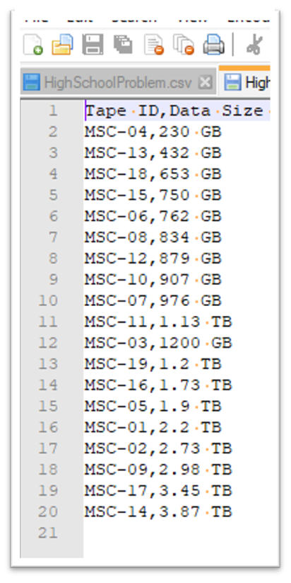
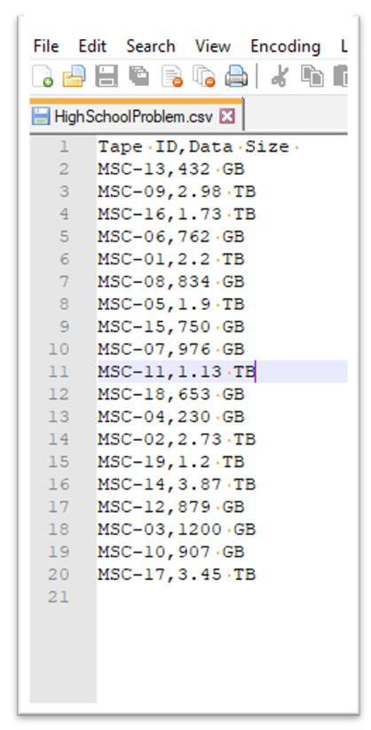

# 02 - Data Organization 
---

## Prompt:

After seeing what an excellent job you did helping the surveyors, the operations team would like your help as well!  They’ve received all the tapes that hold the data from the surveys.  The research team is eager to start getting their hands on the data, so the operations team wants to load the smallest tapes first – in order to get some data back to the researchers as quick as possible.  Given an excel spreadsheet (in comma delimited csv format) that lists the tape ids and the amount of data on each tape, output the tape ids and their associated amount of data, in order from smallest to largest.  The tape ID is a string.  The data size is a string consisting of the format `[integer GB/TB]`.  

Navigate to `data-organization.ipynb` to implement workflow. 

## Goal:

Read input file `tape_data.csv` and write sorted `tape_data_sorted.csv`. You can find `.csv` file inside `/data` dir

